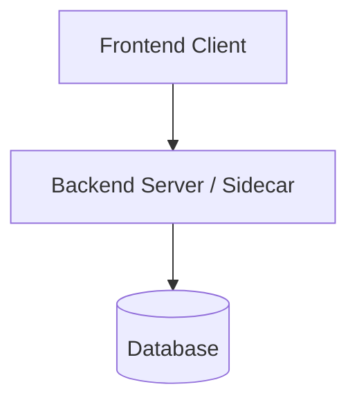

# Modular README Layout Blueprints

> Reference structural templates for `readme-craftsman` based on project archetype.

---

## 🎨 Blueprint A: Visual Showcase / Desktop & Web App Studio

*Best for: GUI Apps, Electron/Tauri Apps, SaaS, Creative Tools, Web Dashboards.*

```markdown
<div align="center">
  
  # [App Name]
  ### *[Catchy One-Line Tagline]*
  <p align="center"><b>[Bold 1-sentence value proposition]</b></p>
  
  <!-- Shields.io Badges -->
  <p align="center">
    <!-- Platform, Frameworks, License, Privacy Badges -->
  </p>

  <p align="center">
    <a href="#-key-features">✨ Key Features</a> •
    <a href="#-visual-showcase">📸 Visual Showcase</a> •
    <a href="#-architecture">🏗️ Architecture</a> •
    <a href="#-quick-start">⚡ Quick Start</a> •
    <a href="#-roadmap">🗺️ Roadmap</a>
  </p>
</div>

---

## 💡 What is [App Name]?
[2 concise paragraphs explaining the core problem and why this app is the premier solution.]

---

## 📸 Visual Showcase
<div align="center">
| 🌟 [Feature 1 Name] | 🛠️ [Feature 2 Name] |
| :---: | :---: |
|  |  |
| *[Caption 1]* | *[Caption 2]* |

| 📊 [Feature 3 Name] | ⚡ [Feature 4 Name] |
| :---: | :---: |
|  |  |
| *[Caption 3]* | *[Caption 4]* |
</div>

---

## ✨ Key Features
### 🚀 1. [Feature Pillar 1]
- **[Sub-feature]:** [Concrete detail].
- **[Sub-feature]:** [Concrete detail].

### 🧠 2. [Feature Pillar 2]
- **[Sub-feature]:** [Concrete detail].

---

## 🏗️ Architecture


---

## ⚡ Quick Start
### Prerequisites
- [Tool 1]
- [Tool 2]

```bash
# Clone and install
git clone [repo_url]
cd [project_name]
npm install

# Run dev environment
npm run dev
```

---

## 🗺️ Roadmap
- [x] Phase 1
- [ ] Phase 2

---

## 📄 License & Contributing
Distributed under the **MIT License**. See `LICENSE` for details.
```

---

## 💻 Blueprint B: Developer Library / SDK / Engine

*Best for: NPM packages, Python PyPI libraries, Rust crates, UI component libraries.*

```markdown
# [Library Name]

> [High-density developer description of the library's capabilities].

[](https://www.npmjs.com/package/package)
[](https://www.npmjs.com/package/package)
[](LICENSE)

## 📦 Installation

```bash
npm install [package-name]
# or
pip install [package-name]
# or
cargo add [package-name]
```

## 🚀 Quick Usage

```typescript
import { createEngine } from '[package-name]';

const engine = createEngine({
  mode: 'optimized',
  cache: true,
});

const result = await engine.process(inputData);
console.log(result);
```

## 📖 API Reference

### `createEngine(options)`
| Option | Type | Default | Description |
| :--- | :--- | :--- | :--- |
| `mode` | `'fast' \| 'optimized'` | `'optimized'` | Processing pipeline mode |
| `cache` | `boolean` | `true` | Enable memory caching |

## 🧪 Testing & Benchmarks
```bash
npm test
```
```

---

## ⌨️ Blueprint C: CLI Tool / Terminal Utility

*Best for: Command-line utilities, scrapers, devops tools, code generators.*

```markdown
<div align="center">
  # ⚡ [CLI Tool Name]
  **[Fast, intuitive terminal tool for doing X]**
</div>

## 📥 Quick Install
```bash
brew install [tool]
# or
npm install -g [tool]
# or
cargo install [tool]
```

## 🎮 Command Cheat Sheet

```bash
# Run basic command
tool run --target ./project

# Interactive mode
tool start --interactive

# Export report
tool export --format json --output report.json
```

## ⚙️ Configuration (`.toolrc.json`)
```json
{
  "verbose": true,
  "outputDir": "./dist"
}
```
```
