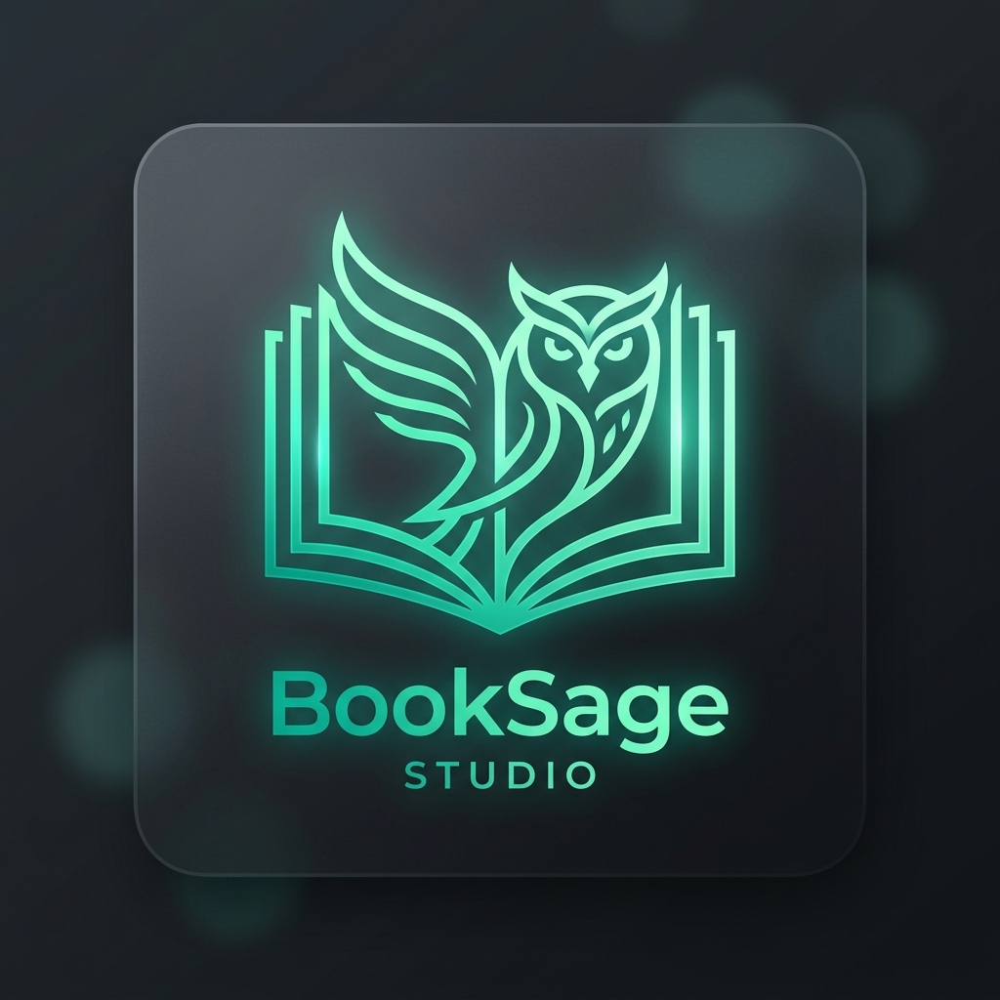
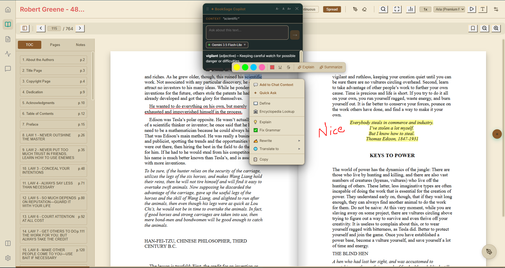
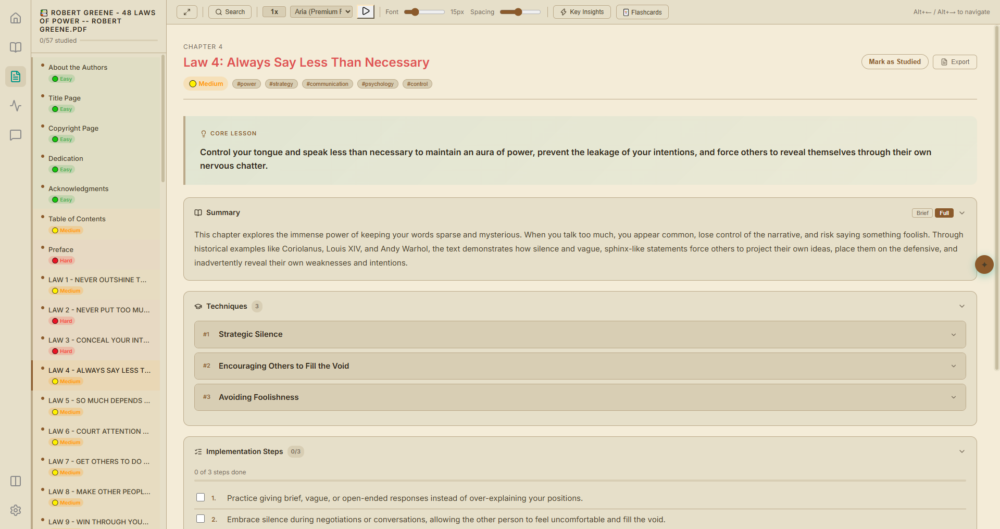
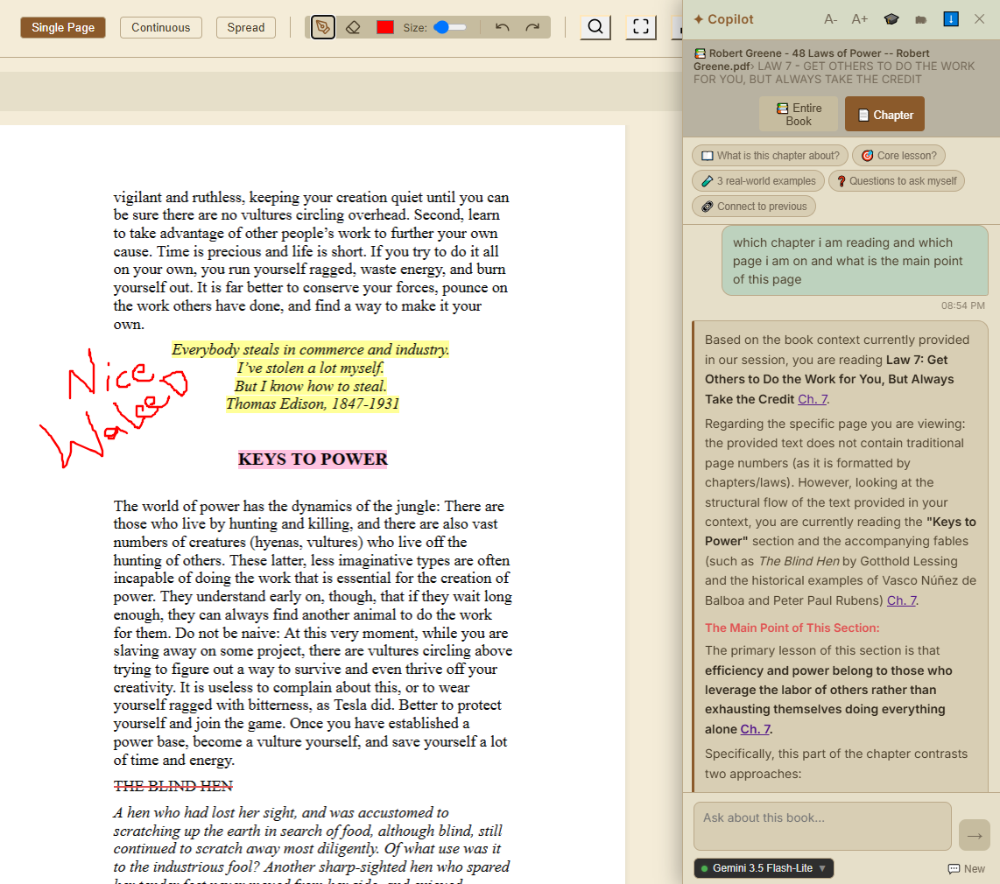
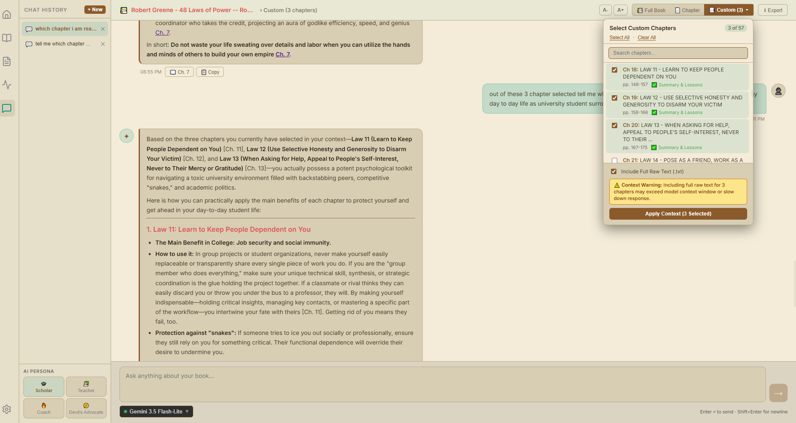
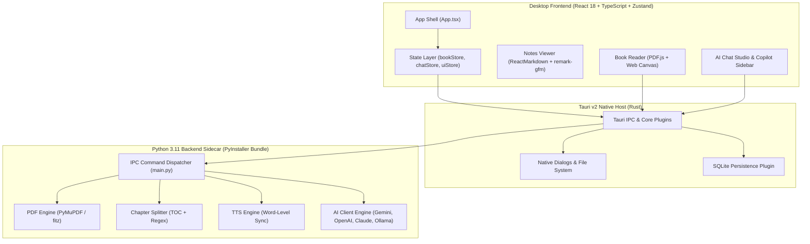

<div align="center">

  

  # BookSage Studio

  ### *The Local-First AI Reading & Structured Learning Desktop App*

  <p align="center">
    <b>Read deeper. Extract structured knowledge. Chat with your books privately.</b>
  </p>

  <!-- Badges -->
  <p align="center">
    <a href="https://v2.tauri.app/"></a>
    <a href="https://react.dev/"></a>
    <a href="https://www.typescriptlang.org/"></a>
    <a href="https://www.python.org/"></a>
    <a href="https://www.sqlite.org/"></a>
    <a href="LICENSE"></a>
    
    
  </p>

  <p align="center">
    <a href="#-key-features">✨ Key Features</a> •
    <a href="#-visual-showcase">📸 Visual Showcase</a> •
    <a href="#-architecture">🏗️ Architecture</a> •
    <a href="#-quick-start">⚡ Quick Start</a> •
    <a href="#-ai-copilot--rag-engine">🤖 AI Copilot</a> •
    <a href="#-roadmap">🗺️ Roadmap</a>
  </p>

</div>

---

## 💡 What is BookSage Studio?

**BookSage Studio** is an all-in-one desktop application designed for serious readers, researchers, and lifelong learners. Instead of juggling detached PDF readers, separate note-taking apps, and generic AI chatbots, BookSage combines everything into a unified, **local-first learning studio**.

Drop in any PDF book or document. BookSage automatically splits chapters, extracts comprehensive structured insights (teachings, actionable steps, core lessons, key quotes, and Obsidian tags), and gives you an immersive reader with a **persistent, context-aware AI Copilot**.

---

## 📸 Visual Showcase

> [!TIP]
> *Drop your high-resolution app screenshots in `assets/screenshots/` to display live visual walkthroughs.*

<div align="center">

| 📖 Immersive PDF Reader (Spread View & Highlights) | 📝 Obsidian-Style Notes & Flashcards |
| :---: | :---: |
|  |  |
| *Two-page 3D spread, 6 color themes, margin cropping & draw layer* | *Structured chapter summaries, action steps & interactive flashcards* |

| ✦ Context-Aware AI Copilot Sidebar | 💬 Full-Screen AI Chat Studio & Citations |
| :---: | :---: |
|  |  |
| *Right-click menu, floating popup, and resizable sidebar assistant* | *Multi-chapter RAG context selector & interactive citation jumping* |

</div>

---

## ✨ Key Features

### 📖 1. Next-Gen PDF Reading Experience
- **Multiple Layout Modes:** Seamlessly switch between **Single Page**, **Continuous Infinite Scroll**, and **Two-Page 3D Realistic Spread Mode**.
- **6 Curated Display Themes:** High-contrast `Dark`, clean `Light`, warm `Sepia`, eye-strain reducing `Night`, pure black `OLED`, and distraction-free `Focus Mode`.
- **Custom Duotone SVG Tinting:** Customize PDF text and page tint colors for optimal readability in any lighting condition.
- **Smart Margin Cropping:** Crop empty page margins dynamically to maximize reading real estate.
- **Full Annotation Suite:**
  - 4-color text highlighters with customizable opacity.
  - Freehand Pen and Drawing layer with full **Undo/Redo** history.
  - Sticky notes and pop-up comments on any highlight.
  - Searchable annotation sidebar with instant page jump.
  - One-click annotation export to Markdown.
- **Synchronized Text-to-Speech (TTS):** Character-proportional word-by-word highlighted reading voice powered by Python engine.

---

### 🧠 2. Automated AI Knowledge Extraction Pipeline
- **Chapter Splitting:** Automatic table of contents detection and regex fallback using high-speed `PyMuPDF`.
- **Structured JSON Synthesis:** Converts raw book text into standardized, high-density study guides:
  - 📌 **Executive Summary & Core Lesson:** The central takeaway distilled.
  - 🛠️ **Key Teachings & Techniques:** Step-by-step methodologies and explanations.
  - ✅ **Actionable Implementation Steps:** Ready-to-use checklist items.
  - 💬 **Supporting Quotes:** Key passages extracted with source context.
  - 🏷️ **Obsidian Tags & Difficulty Rating:** Categorization for personal knowledge management (PKM).
- **Universal AI Model Support:**
  - Google Gemini (`gemini-2.5-flash`, `gemini-1.5-pro`)
  - OpenAI (`gpt-4o`, `gpt-4o-mini`)
  - Anthropic Claude (`claude-3-5-sonnet`)
  - Groq & DeepSeek
  - **Ollama (100% Offline Local LLMs)**

---

### 📝 3. Interactive Notes Studio & Obsidian Bridge
- **Obsidian Visual Grammar:** Beautiful typography with obsidian-style red headers, styled callouts, and code blocks.
- **Interactive Checklists:** Track your progress as you implement teachings into your daily workflow.
- **Flashcard Study Mode:** Turn chapter lessons into interactive, flippable flashcards for spaced repetition.
- **Native Obsidian Export:** Export clean, beautifully formatted `.md` vault files ready for Obsidian, Logseq, or Notion.

---

### ✦ 4. In-App AI Copilot & Full Chat Studio
- **Persistent Copilot Sidebar:** Resizable right-side assistant docked directly in the reader and notes views.
- **Selection Popup & Smart Context Menu:** Select any text and right-click to instantly trigger:
  - 📋 *Summarize*, 🧠 *Simplify (ELI5)*, 💡 *Explain*, ✂️ *Make Shorter/Longer*, ✅ *Fix Grammar*, 🌐 *Translate (10+ languages)*.
- **4 Distinct AI Personas:**
  - 🎓 **Scholar:** Deep, academic, detailed analysis.
  - 👨‍🏫 **Teacher:** Clear, simplified, structured breakdowns.
  - 🔥 **Coach:** Motivating, highly actionable real-world execution advice.
  - 🤔 **Devil's Advocate:** Critical thinking, challenging assumptions and weaknesses in arguments.
- **Source-Grounded Citations (`[Ch. 4 ↗]`):**
  - AI responses embed interactive citation badges that show chapter title and page range on hover.
  - Clicking any citation badge instantly teleports the PDF canvas to that chapter's exact starting page.
- **Flexible Multi-Chapter RAG Context:**
  - Toggle between **Entire Book**, **Current Chapter**, or **Custom Selection** with live search and optional full raw text injection.

---

### 🔒 5. 100% Local-First & Private
- **Local SQLite Database:** All reading progress, highlights, drawings, bookmarks, notes, and chat histories stay on your machine.
- **Zero Plaintext Credentials:** API keys are encrypted and stored safely via the native OS keychain (`keyring`).
- **Offline Capable:** Run completely offline using local models via Ollama.

---

## 🏗️ Architecture

BookSage Studio is built on an ultra-responsive, modular multi-process architecture:



---

## 💻 Tech Stack

| Layer | Technology | Rationale |
| :--- | :--- | :--- |
| **Desktop Shell** | [Tauri v2](https://v2.tauri.app/) | Minimal memory footprint (~40MB RAM), native Rust performance, secure sandbox. |
| **Frontend** | [React 18](https://react.dev/) + [TypeScript](https://www.typescriptlang.org/) | Type-safe, modular UI components with high render efficiency. |
| **State Management** | [Zustand](https://github.com/pmndrs/zustand) | Lightweight, un-opinionated store with persistent SQLite and LocalStorage sync. |
| **PDF Rendering** | [pdfjs-dist](https://mozilla.github.io/pdf.js/) | Fast in-browser canvas rendering with custom double-buffering. |
| **Markdown Engine** | [react-markdown](https://github.com/remarkjs/react-markdown) + [remark-gfm](https://github.com/remarkjs/remark-gfm) | Custom component overrides for interactive citations, badges, and callouts. |
| **Python Sidecar** | [Python 3.11](https://www.python.org/) + [PyMuPDF](https://pymupdf.readthedocs.io/) | High-speed PDF text/TOC extraction, regex parsing, and streaming AI orchestration. |
| **Database** | [SQLite](https://www.sqlite.org/) via `@tauri-apps/plugin-sql` | Robust, local-first ACID storage for annotations, sessions, and book metadata. |
| **Styling** | Vanilla CSS Tokens (`_group.css`) | Zero runtime CSS overhead, full control over themes and high-contrast duotone filters. |

---

## ⚡ Quick Start

### Prerequisites
Make sure you have the following installed on your machine:
- **Node.js** (v18.0 or higher) — [Download Node.js](https://nodejs.org/)
- **Rust & Cargo** — [Install Rust](https://www.rust-lang.org/tools/install)
- **Python 3.11** — [Download Python](https://www.python.org/downloads/)

---

### 📥 1. Clone & Install Dependencies

```bash
# Clone the repository
git clone https://github.com/Waleed-Khalid-dev/BookSage.git
cd BookSage

# Install frontend dependencies
npm install

# Install Python sidecar dependencies
cd python
pip install -r requirements.txt
cd ..
```

---

### 🚀 2. Run in Development Mode

```bash
# Start frontend and Tauri development environment
npm run tauri dev
```

---

### 📦 3. Build Production Installer (`.msi` / `.exe`)

```bash
# Build the production release bundle
npm run tauri build
```
The output installer will be generated in `src-tauri/target/release/bundle/`.

---

## 🗺️ Project Roadmap & Phase Status

- [x] **Phase 0: Project Scaffold** — Tauri v2 + React 18 + Zustand stores + Python Sidecar
- [x] **Phase 1: PDF Engine** — PyMuPDF extraction, TOC detection, chapter chunking
- [x] **Phase 2: AI Extraction Engine** — Structured JSON schema validation, multi-model clients
- [x] **Phase 3: Pipeline Studio** — Chapter queue, live progress visualization, batch retries
- [x] **Phase 3.5: Local SQLite Persistence** — Automatic schema migrations, persistent database
- [x] **Phase 4: High-Performance PDF Reader** — Single, continuous, and 3D Two-Page Spread views
- [x] **Phase 4.5: Reader Polish & Annotations** — 6 themes, margin crop, SVG duotone, highlights, freehand pen
- [x] **Phase 5: Obsidian-Style Notes Studio** — Interactive teachings, study checklists, flashcards
- [x] **Phase 5b/c: Obsidian Vault Export & Notes TTS** — One-click vault export & word-level TTS
- [x] **Phase 6: In-App AI Copilot** — Sidebar, selection popup, 4 personas, multi-chapter RAG & citations
- [ ] **Phase 7: Enhanced Library View** — Visual shelf management, reading goals, and import analytics *(In Progress)*
- [ ] **Phase 8: Settings & Keyring Security** — Hardware-backed credential management
- [ ] **Phase 9: Production Packaging** — WiX/NSIS signed releases

---

## 🤝 Contributing

Contributions, issues, and feature suggestions are always welcome!

1. Fork the Project (`https://github.com/Waleed-Khalid-dev/BookSage`)
2. Create your Feature Branch (`git checkout -b feature/AmazingFeature`)
3. Commit your Changes (`git commit -m 'feat: Add some AmazingFeature'`)
4. Push to the Branch (`git push origin feature/AmazingFeature`)
5. Open a Pull Request

---

## 📄 License

Distributed under the **MIT License**. See [`LICENSE`](LICENSE) for more information.

---

<div align="center">
  <sub>Built with ❤️ by <a href="https://github.com/Waleed-Khalid-dev">Waleed Khalid</a> • Designed for lifelong learners.</sub>
</div>
