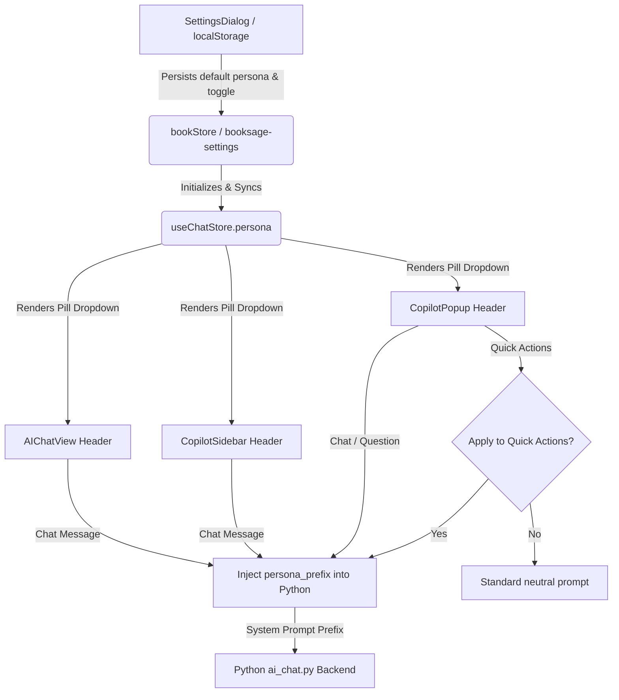

# Copilot Persona & Tone Selector Enhancement Plan

> **Task Slug:** `copilot-persona-enhancement`  
> **Target:** Full-stack implementation, UI polish, settings integration, and persistence for Copilot Persona selection across BookSage.  
> **Status:** 📝 Ready for Implementation  
> **Created:** 2026-10-04  

---

## 🎯 Objectives & Scope

Bring the **Persona / Tone Selector** to 100% completion across all reading surfaces:
1. **UI Dropdowns:**
   - **CopilotPopup (`CopilotPopup.tsx`):** Compact header pill button (`[ 🎓 Scholar ▾ ]`) with aesthetic popover menu.
   - **CopilotSidebar (`CopilotSidebar.tsx`):** Replace raw icon button with matching `[ 🎓 Scholar ▾ ]` pill dropdown.
   - **AIChatView (`AIChatView.tsx`):** Add matching `[ 🎓 Scholar ▾ ]` pill dropdown to header action bar.
2. **Persistence (`booksage-settings`):**
   - Wire `copilotPersona` and `applyPersonaToQuickActions` into `bookStore` settings with `localStorage` persistence.
   - Load persisted persona on startup into `useChatStore`.
3. **Settings Dialog (`SettingsDialog.tsx`):**
   - Add new **AI Copilot** tab (or section alongside Theme, Shortcuts, API Keys).
   - Includes:
     - Default Persona selector with preview icons & descriptions.
     - Toggle switch: *"Apply Persona Tone to Quick Actions"* (default: OFF, preserves neutral summaries unless user desires personalized tone).
4. **Python & Quick Actions Integration:**
   - Ensure `sendQuickAction` checks `applyPersonaToQuickActions` and passes `persona_prefix` when enabled.
   - Keep free-form chat messages always injected with the active persona.

---

## 🏗️ Architecture & Component Flow

---

## 📋 Implementation Phases

### Phase 1: Store & Persistence Layer
- [ ] In `src/stores/bookStore.ts`:
  - Add `copilotPersona: CopilotPersona` (default `'scholar'`) and `applyPersonaToQuickActions: boolean` (default `false`) to settings interface & state.
  - Add actions `setCopilotPersona(p)` and `setApplyPersonaToQuickActions(val)`.
  - Add both keys to `partialize` array in `booksage-settings` localStorage configuration.
- [ ] In `src/stores/chatStore.ts`:
  - Sync `persona` state with `bookStore.getState().copilotPersona` on initialization.
  - Update `setPersona` to also sync with `bookStore.getState().setCopilotPersona`.
  - In `sendQuickAction`: check if `bookStore.getState().applyPersonaToQuickActions` is `true`; if so, inject `persona_prefix: ${PERSONA_PROMPTS[persona]}\n\n`.

### Phase 2: UI Pill Dropdown Component & Styling
- [ ] Create reusable component or unified markup for Persona Pill:
  - Button format: `[ 🎓 Scholar ▾ ]` with hover states, active persona indicator, subtle chevron.
  - Flyout menu: lists all 4 personas with icons, titles, and descriptions:
    - 🎓 **Scholar** — Deep academic analysis, cites principles.
    - 👨‍🏫 **Teacher** — Simple explanations, uses analogies.
    - 🔥 **Coach** — Action-oriented, motivational advice.
    - 🤔 **Devil's Advocate** — Challenges assumptions & flaws.
  - Click-away listener (`pointerdown`) and `Esc` key handling.
- [ ] Integrate into:
  - `src/components/copilot/CopilotPopup.tsx` (next to font size buttons in header).
  - `src/components/copilot/CopilotSidebar.tsx` (replaces standalone icon button).
  - `src/components/views/AIChatView.tsx` (in header action bar next to Context Mode toggles).

### Phase 3: Settings Dialog Integration (`SettingsDialog.tsx`)
- [ ] Add new tab **"Copilot"** / **"AI Copilot"** with icon (e.g. `Sparkles` or `Bot`).
- [ ] Settings controls:
  - **Active Persona Picker:** Grid/cards of the 4 personas with icons and descriptions.
  - **Quick Actions Behavior Toggle:** Clean toggle switch for *"Apply Persona Tone to Quick Actions"* with explanatory helper text.
- [ ] Add corresponding styling in `SettingsDialog.css`.

### Phase 4: Verification & Pre-flight Validation
- [ ] Verify persistence across page refresh and app restart.
- [ ] Verify switching persona in `CopilotPopup` updates `CopilotSidebar` and `AIChatView` simultaneously.
- [ ] Verify test queries for each persona in Python backend:
  - Scholar answers with academic rigor.
  - Teacher answers with plain analogies.
  - Coach provides action steps.
  - Devil's Advocate challenges assumptions.
- [ ] Verify `npm run build` passes with zero type errors.

---

## 🔍 Verification Checklist

- [ ] `CopilotPopup` has functional `[ 🎓 Scholar ▾ ]` dropdown.
- [ ] `CopilotSidebar` has matching `[ 🎓 Scholar ▾ ]` dropdown.
- [ ] `AIChatView` has matching `[ 🎓 Scholar ▾ ]` dropdown.
- [ ] Persona choice persists across reloads (`localStorage.getItem('booksage-settings')`).
- [ ] Settings dialog has Copilot section with persona selector and Quick Action toggle.
- [ ] Quick Actions respect the toggle (neutral when off, styled when on).
- [ ] Full project compiles cleanly with `tsc && vite build`.
