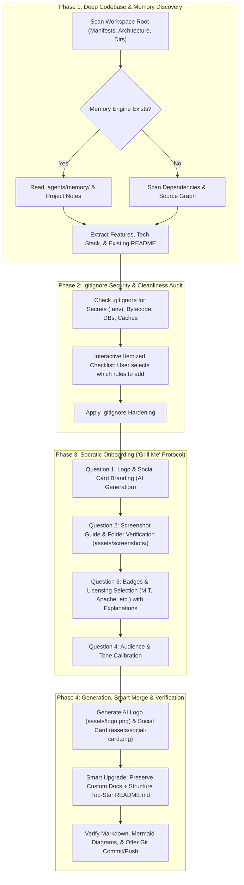

# Plan: `readme-craftsman` — Interactive Top-Star GitHub README Generator Skill

> **Skill Goal:** A portable, interactive agent skill that you and your friends can drop into any project. It autonomously discovers the codebase and project memories, conducts an interactive Socratic onboarding interview ("Grill Me"-style), performs a detailed `.gitignore` security audit, generates AI brand logos & social cards, guides screenshot placement, and produces world-class GitHub README files styled like top starred repositories.

---

## 🎯 Finalized Architecture & Design Decisions

### 1. Trigger & Portability
- **Primary Slash Command:** `/readme`
- **Location:** `.agents/skills/readme-craftsman/`
- **Files Created in Skill:**
  - `SKILL.md`: Main autonomous protocol, Socratic interview script, and generator logic.
  - `references/badges-catalog.md`: Curated catalog of Shields.io badges, status tags, and licenses with explanations.
  - `references/gitignore-templates.md`: Hardening rules categorized by ecosystem (Node, Python, Rust, Go, Java, Docker, Secrets, OS).
  - `references/layout-templates.md`: Layout blueprints (Visual Showcase, Technical Library, CLI/Dev Tool).
- **Portability:** Can be copied into any repo's `.agents/skills/` directory and run with zero configuration.

---

## 🔄 4-Phase Interactive Workflow Protocol

---

## 🛠️ Detailed Phase Specifications

### 1. Phase 1 — Autonomous Discovery
- **Memory Probing:** Checks `.agents/memory/MEMORY.md` and related topic notes for user preferences, project conventions, and architecture decisions.
- **Stack Detection:** Inspects `package.json`, `Cargo.toml`, `pyproject.toml`, `go.mod`, `pom.xml`, etc., extracting exact versions and frameworks.
- **Existing README Analysis:** Extracts custom quick-start commands, unique domain explanations, or external links to preserve them during the upgrade.

### 2. Phase 2 — `.gitignore` Security & Cleanliness Audit
- **Detection Engine:** Cross-references project files and stack against security benchmarks:
  - 🔑 **Secrets:** `.env`, `.env.*`, `*.pem`, `*.key`, `credentials.json`
  - 📦 **Bytecode & Build:** `node_modules/`, `dist/`, `target/`, `__pycache__/`, `*.pyc`, `*.egg-info/`
  - 💾 **Local Databases:** `*.sqlite`, `*.db`, `*.sqlite3`
  - 💻 **OS Artifacts:** `.DS_Store`, `Thumbs.db`, `desktop.ini`
- **Itemized Checklist:** Presents detected unignored rules to the user and applies approved protections.

### 3. Phase 3 — Socratic Onboarding Interview
- **1. AI Visual Assets:**
  - Asks user for visual style preferences.
  - Calls `generate_image` to produce:
    - `assets/logo.png` (1:1 app icon logo).
    - `assets/social-card.png` (16:9 GitHub OpenGraph social preview).
- **2. Screenshot Guidance:**
  - Explains the importance of visual proof.
  - Generates a bespoke list of 3–5 key views to capture based on actual detected UI components.
  - Guides placement into `assets/screenshots/` and confirms they are in place.
- **3. Badges & Licensing Consultation:**
  - Explains the purpose and legal protections of each badge (MIT, Apache 2.0, CI status, Platform, Privacy, Sponsors).
  - Asks permission before adding them.

### 4. Phase 4 — Smart Generation & Delivery
- Generates a structured `README.md` containing:
  - Centered Hero with Logo & Social preview.
  - Badges strip with flat-square style.
  - Visual 4-grid screenshot showcase.
  - Deep-dive feature pillars with icons.
  - Mermaid architecture sequence/flow diagram.
  - Step-by-step Quick Start guide with prerequisites.
  - Roadmap phase tracker.
  - License & Contributing guidelines.
- Offers automatic git staging, commit, and push.

---

## 📋 Implementation Tasks (Ready for `/create`)

| Task # | File / Component | Description | Status |
| :--- | :--- | :--- | :---: |
| **1** | `.agents/skills/readme-craftsman/SKILL.md` | Author core skill instructions, Socratic interview rules, and discovery protocol | ⏳ Planned |
| **2** | `references/badges-catalog.md` | Create comprehensive Shields.io badge catalog and license explanations | ⏳ Planned |
| **3** | `references/gitignore-templates.md` | Create ecosystem-specific `.gitignore` hardening templates | ⏳ Planned |
| **4** | `references/layout-templates.md` | Create modular README layout blueprints (Visual, Technical, Minimal) | ⏳ Planned |
| **5** | Verification & Test | Test `/readme` skill trigger and verification in the workspace | ⏳ Planned |
